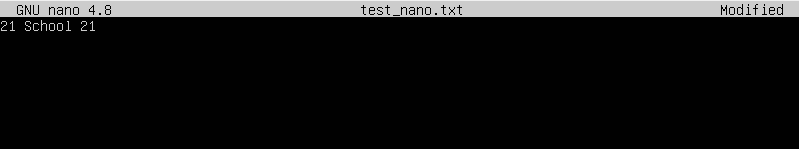
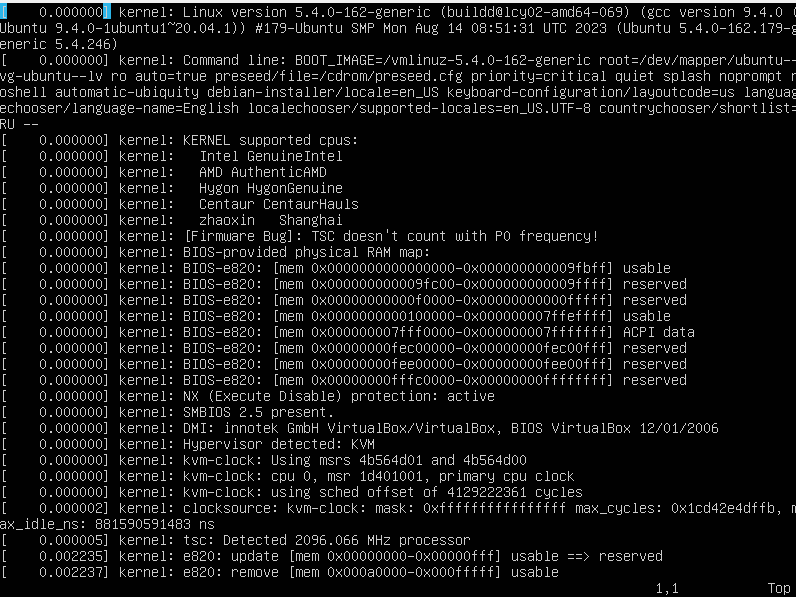

# Операционные системы UNIX/Linux (Базовый).

## Содержание
- [Операционные системы UNIX/Linux (Базовый).](#операционные-системы-unixlinux-базовый)
	- [Содержание](#содержание)
	- [Part 1. Установка OC](#part-1-установка-oc)
	- [Part 2. Создание пользователя](#part-2-создание-пользователя)
	- [Part 3. Настройка сети ОС](#part-3-настройка-сети-ос)
	- [Part 4. Обновление ОС](#part-4-обновление-ос)
	- [Part 5. Использование команды **sudo**](#part-5-использование-команды-sudo)
	- [Part 6. Установка и настройка службы времени](#part-6-установка-и-настройка-службы-времени)
	- [Part 7. Установка и использование текстовых редакторов](#part-7-установка-и-использование-текстовых-редакторов)
	- [Part 8. Установка и базовая настройка сервиса **SSHD**](#part-8-установка-и-базовая-настройка-сервиса-sshd)
	- [Part 9. Установка и использование утилит **top**, **htop**](#part-9-установка-и-использование-утилит-top-htop)
	- [Part 10. Использование утилиты **fdisk**](#part-10-использование-утилиты-fdisk)
	- [Part 11. Использование утилиты **df**](#part-11-использование-утилиты-df)
	- [Part 12. Использование утилиты **du**](#part-12-использование-утилиты-du)
	- [Part 13. Установка и использование утилиты **ncdu**](#part-13-установка-и-использование-утилиты-ncdu)
	- [Part 14. Работа с системными журналами](#part-14-работа-с-системными-журналами)
	- [Part 15. Использование планировщика заданий **CRON**](#part-15-использование-планировщика-заданий-cron)

## Part 1. Установка OC

- Установка Ubuntu 20.04 Server LTS без графического интерфейса:

## Part 2. Создание пользователя
- Выполнил команды для создания пользователя и добавления его в группу adm:

- Вывод команды cat /etc/issue:

## Part 3. Настройка сети ОС

- Выполнил команду для смены имени машины: sudo vi /etc/hostname - открыл в текстом редакторе vi с правами суперпользователя файл, хранящий название машины и заменил прежнее на aemmazub-1

- Скриншот с измененным именем пользователем на aemmazub-1:

- Просмотр текущей временной зоны

- Установка текущеней временной зоны: 

- Проверка, что зона установлена:

- Вызов команды ip -a link:

- lo (loopback device) – виртуальный интерфейс, присутствующий по умолчанию в любом Linux. Он используется для отладки сетевых программ и запуска серверных приложений на локальной машине.
  
- Вызов ip address, красным выделен ip адрес от DHCP

- DHCP (англ. Dynamic Host Configuration Protocol — протокол динамической настройки узла) — сетевой протокол, позволяющий сетевым устройствам автоматически получать IP-адрес и другие параметры, необходимые для работы в сети TCP/IP. 

## Part 4. Обновление ОС

- Прописал команды:
sudo apt update

## Part 5. Использование команды **sudo**

- sudo - консольная утиллита, позволяющая обычному пользователю дать возможность использовать root-права, не меняя текущего пользователя на root для выполнения каких-либо действий. Означает superuser do - суперпользователь делает.

- Убедился, что у user-1 есть права на выполнения sudo

- Изменил hostname с aemmazub-1 на aemmazub-1234, проверил что находился под нужным пользователем

## Part 6. Установка и настройка службы времени

- Использовал timedatectl вывел время своего часового пояса
  Вторая команда timedatectl show, включающая NTPSynchronized=yes

## Part 7. Установка и использование текстовых редакторов

1. Открыл файл text_vim.txt через команду: vim text_vim.txt
2. Закрыл с сохранениями: ESC + : + w + q
   

1. Открыл файл text_vim.txt через команду: vim text_vim.txt
2. Прописал \:s/aemmazub/21 School 21, нажал Enter
3. Прописал для выхода без сохранения: :q!

- Содержание text_vim.txt после выхода

1. Команда для замены \:s/old_word/new_word
2. Команда для поиска /searded_word
   

1. Открыл через nano test_nano.txt
2. ctrl+x, y, enter

- Вывод test_nano.txt

1. Стер aemmazub, написал 21 School 21
2. ctrl+x, n

- Вывод test_nano

- Открыл, нажал ctrl + x, вписал aemmazub, курсор перешел в начало искомой строки

- Открыл, написал aemmazub, esc , выбрал yes

- Открыл, написал aemmazub, esc , выбрал no

- Вывод содержимого после выхода без сохранения

- Нажал на f7, написал искомую строку aemmazub, содержимое подсветилось зеленым, где обнаружилась строка

- Нажал на f4, первое поле для искомой строки, второе на какую будем менять

## Part 8. Установка и базовая настройка сервиса **SSHD**

- Установил SSHd

- Добавил автостарт службы

- Изменил sshd_config, вписал Port2022

- ps -aux:
	a - вывод процессов всех пользователей
	u - более подробный отчет по процессам выводимым ps
	x - вывод процессов в фоне и во време загрузки

- Перезагрузка SSHd

- Вывод команды netstat -tan
	t - вывод процессов использующих TCP
	a - вывод всех процессов в том числе скрытых
	n - представить хостовые имена в виде чисел, а не в виде символов

1. proto - протокол, по которому осуществляется соедение

2. Recv-Q - количество байтов которые должны были полученны приложением, но помещены в буфер приема пакетов tcp/ip

3. Send-Q - количество байтов не отправленных или не подтверженных байтов, которые помещены в буфер отправки tcp/ip

4. Local address - локальный адрес и порт

5. Foreigh address - IP-адрес и номер порта удаленного компьютера, к которому подключен сокет.

6. State - состояние tcp-соединения

7. 0.0.0.0 - адрес, который позволяет получить службе все доступные ip-адреса доступные на компьютере 

## Part 9. Установка и использование утилит **top**, **htop**
- uptime: 55 min
количество авторизованных пользователей: 1
общую загрузку системы: 0.00 0.00 0.00
общее количество процессов: 101
загрузку cpu: 0.0 su, 0.0 sy, 0.0 ni, 100.0 id, 0.0 wa, 0.0 hi, 0.0 si, 0.0 st
загрузку памяти: 156.8 used
pid процесса занимающего больше всего памяти: 679
pid процесса, занимающего больше всего процессорного времени: 679

- Сортировка по PID

- Сортировка по CPU%

- Сортировка по MEM%

- Сортировка по TIME%

- Отфильтрованному для процесса sshd

- С процессом syslog, найденным, используя поиск

- Вывод с hostname, clock и uptime

## Part 10. Использование утилиты **fdisk**
- Запустил команду fdisk -l

## Part 11. Использование утилиты **df** 

Тип файловой системы ext4

## Part 12. Использование утилиты **du**
- Размер /home

- Размер /var

- Размер /var/log

- Размер всего содержимого в /var/log 

## Part 13. Установка и использование утилиты **ncdu**

- Размер папки /home

- Размер папки/var

- Размер папки /var/log

## Part 14. Работа с системными журналами
- Вывод лога dmesg

- Вывод лога syslog

- Вывод лога auth.log

- Вход через авторизацию(login), пользователь aemmazub, 20:42:58

- Вывод о перезапуске SSHd

## Part 15. Использование планировщика заданий **CRON**

- Вызвал crontab -e, прописал шаблон для выполнения планировщика заданий

- Содержание syslog

- Удаление журнала для планировщика заданий

